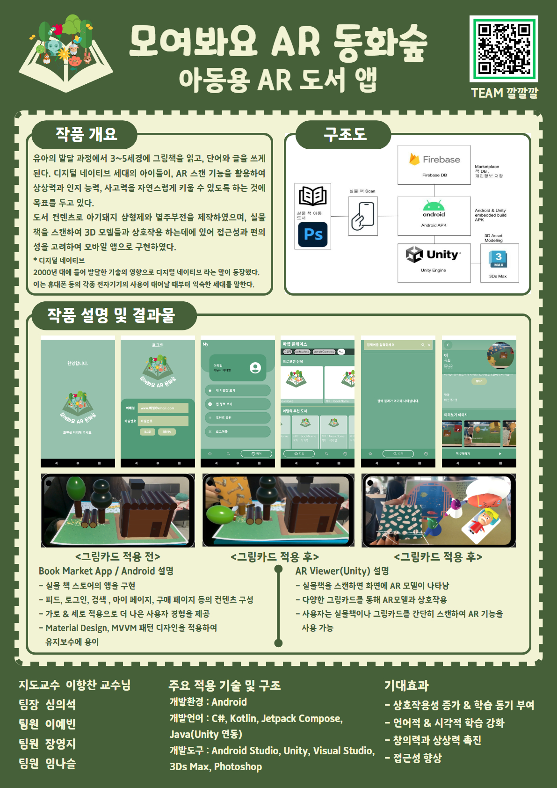

# 🌳 AR_Book_Capstone_Project: 모여봐요 AR 동화숲 (TEAM.깔깔깔)
**모여봐요 AR 동화숲**은 아이들이 책을 멀리하는 현실에서  
흥미와 몰입을 유도할 수 있는 **AR(증강현실) 기반 인터랙티브 동화 콘텐츠**를 개발하는 프로젝트입니다.  
책에 카메라를 비추면, 동화 속 캐릭터가 살아 움직이고, 터치하면 상호작용하는 경험을 제공하여  
**독서가 놀이처럼 느껴지는 몰입형 환경**을 구현하였습니다.

-----

## 🔍 프로젝트 개요
- 작품개요 : 아동용 AR 도서 앱
  - 유아의 발달 과정에서 3~4세경에 이르러 그림책을 읽기 시작하며, 5세 가량에서 단어를 읽고 글을 쓸 수 있게 된다. 디지털 네이티브 세대로써 부모의 도움을 통하거나 스스로 디지털 기기를 사용하여 조작할 수 있는 AR 도서로 하여금 아이가 각종 상상을 하며 인지 능력과 상상력, 사고력을 자연스럽게 키울 수 있도록 하는 것에 목표를 두고 있다. 도서 컨텐츠로는 아기돼지 삼형제와 별주부전을 제작하였으며, 실물책을 스캔하면 사용자의 기기에서 3D 모델들과 상호작용을 할 수 있다. 또한 사용자의 접근성, 편리성을 고려하여 모바일 앱으로 구현하였다.
    
    * 디지털 네이티브 : 2000년 대에 들어 발달한 기술의 영향으로 디지털 네이티브 라는 말이 등장했다. 이는 휴대폰 등의 각종 전자기기의 사용이 태어날 때부터 익숙한 세대를 말한다.

-----

## 주요 적용 기술 및 구조

- 개발환경 : Android
- 개발언어 : C#, Kotlin, Jetpack Compose, Java(Unity 연동)
- 개발도구: Android Studio, Unity, Visual Studio, 3Ds Max, Photoshop

-----

## 구현 범위
- Unity, Visual Studio : AR 기능 구현
- 3Ds Max : Model을 작업하기 위한 작업
- Android App : Native 뷰어 및 마켓 플레이스
- Photoshop : 실물 스캔 가능한 책 & 아이템 카드

본 앱은, 유니티와 안드로이드가 혼합되어 빌드된 앱으로, 
3Ds Max 를 이용한 모델링을 이용한 AR 기능의 유니티와, 마켓플레이스 네이티브를 탑재한 안드로이드 앱을 
APK 로 빌드하여, 통합 모바일 앱으로 실물책을 스캔하여 활용할 수 있도록 구현한다. 
유니티 기능의 경우 앱 내에서 유니티 화면을 호출하도록 하며, 마켓 플레이스의 경우 안드로이드에서 구현하고 자체적으로 FireBase 의 DB 를 활용하며, 필요한 정보를 저장할 때 활용한다.

-----
## APK 다운로드
👉 [app-debug.apk 다운로드](https://drive.google.com/file/d/10sWr82yBHVd-YXtNoxV1t8AV2rj6bMqR/view?usp=drive_link)

-----

## 기대효과
AR 도서는 기술과 교육의 융합을 통해 어린이들에게 새로운 학습 경험을 제공한다. AR 기술과 도서와의 상호작용은 기존 도서와 전자책보다 직접적이고 실감 나는 경험을 제공한다. 이를 통해 독서가 하나의 즐거움으로 이어져 학습 동기를 증진 시킬 수 있을 것으로 기대된다. 뿐만 아니라 다양한 방식으로 해석할 수 있기에 인지능력, 상상력, 사고력의 증진에도 도움이 될 것으로 보인다. 또한 특별한 장비 없이도 스마트폰, 태블릿을 통해 쉽게 접근할 수 있는 안드로이드 앱으로 구현되어 많은 사용자의 사용이 기대된다.

-----

## 👩‍💻 팀 구성 및 역할
- 심의석(팀장) : 안드로이드 앱 설계 및 개발, 안드로이 앱 유니티 연동
- 이예빈(팀원) : 3D 모델 작업, 유니티 구현부
- 장영지(팀원) : 실물 책 기획 및 제작, 유니티 구현부
- 임나슬(팀원) : 3D 모델 작업, 유니티 구현부

------

  
